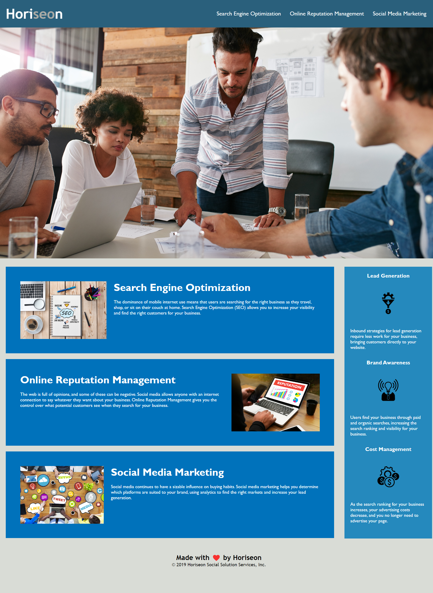

# Horiseon Optimization - Module 1 Assignment

## What I did:  
* I optimized the html language to adhere to semantic styling properties. Instead of `
`, I added elements such as `<header>`, `<footer>`, `<section>`, and `<article>` to create a more congruent flow and add more details about the sections from which I was working {see in HTML examples}.  
* In doing this, I needed to go into the CSS and provide additional changes to ensure all styling properties were correctly applied.  
* I also optimized the CSS code to make sure certain things were not redundant. I grouped several sections together instead of them being all separated {see in CSS examples}.      
* Any images that did not have an alt value were given one with a descriptive tag.    
* The title is now more applicable to the website and less vague.    
* One of the links was not working properly, so I made sure that the coding included elements that allowed the links to go to the appropriate area of the page. I also added smooth scrolling within the CSS for a nicer flow.   

## HTML Examples   
> Before:   
>> `
`   
>> `
`   
>> `<h1>Horiseon</h1>`   

> After:   
>> `<header>`   
>> `<section class="content">`   
>> `<h1>Hori<em>seo</em>n</h1>`   

## CSS Examples
> Before:   
>> .benefit-lead, }   
    margin-bottom: 32px;    
    color: #ffffff;   
}      
>>.benefit-brand, {   
    margin-bottom: 32px;    
    color: #ffffff;   
}     
>>.benefit-cost {    
    margin-bottom: 32px;    
    color: #ffffff;    
}     

> After:    
>> .benefit-lead,    
.benefit-brand,    
.benefit-cost {    
    margin-bottom: 32px;    
    color: #ffffff;    
}     

## Live Website
Please feel free to check out a live version of my project [here](https://cmash93.github.io/ModuleOne/ "Title").     
## Mockup    
